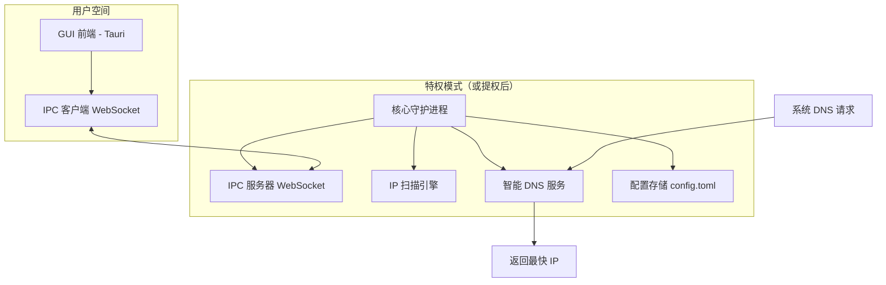

## 1. 项目概述

**TurboGitHub** 是一款使用 Rust 编写的 GitHub 访问加速工具，旨在通过智能 DNS 解析和最优 IP 优选，显著提升国内开发者访问 GitHub 相关域名的速度与稳定性。工具采用客户端-守护进程架构，提供现代化的图形用户界面（GUI），支持 Windows、macOS 和 Linux 三大操作系统。

### 1.1 核心功能
- **自动优选 IP**：持续探测 GitHub 域名（如 `github.com`、`api.github.com`、`raw.githubusercontent.com` 等）的 IPv4 地址，筛选出连通性好、延迟低的 IP。
- **智能 DNS 解析**：作为本地 DNS 服务，拦截对加速域名的查询请求，动态返回当前最优 IP。
- **可视化控制**：通过 GUI 界面轻松启动/停止加速服务、查看实时状态、编辑配置、监控日志。
- **系统托盘集成**：后台常驻，无需主窗口即可快速操作。

### 1.2 技术栈
| 组件 | 技术 | 说明 |
|------|------|------|
| 核心守护进程 | Rust + Tokio | 高性能异步运行时，负责 IP 扫描、DNS 服务、IPC 服务器 |
| GUI 前端 | Tauri + React（可选） | 轻量级桌面应用框架，前端使用 HTML/CSS/JS 构建界面 |
| IPC 通信 | WebSocket (JSON-RPC) | 守护进程与 GUI 之间的双向通信协议 |
| DNS 服务 | Hickory DNS（原 trust-dns） | 提供完整的 DNS 服务器和解析器实现 |
| 配置管理 | Serde + TOML | 配置文件解析与序列化 |
| 日志 | Tracing | 结构化日志，支持输出到控制台和文件 |

---

## 2. 系统架构

TurboGitHub 采用前后端分离的架构，分为**核心守护进程**（需管理员/root 权限）和 **GUI 前端**（普通用户权限）。两者通过本地 WebSocket 连接进行通信。



### 2.1 核心守护进程
- 长期运行的后台服务，以管理员/root 权限启动（需绑定 53 端口）。
- 包含三个主要模块：IP 扫描引擎、智能 DNS 服务、IPC 服务器。
- 定期扫描 GitHub 域名 IP 并维护一个按速度排序的 IP 池。
- 监听本地 WebSocket 端口（如 3030），接收 GUI 发来的命令（启动/停止、查询状态、更新配置）。

### 2.2 GUI 前端
- 基于 Tauri 构建，前端可使用 React、Vue 或 Svelte。
- 通过 WebSocket 与核心守护进程通信，提供图形化操作界面。
- 支持系统托盘图标，可常驻后台。

---

## 3. 核心模块设计

### 3.1 IP 扫描引擎
**职责**：周期性探测 GitHub 域名的 IP 地址，检测连通性、延迟（RTT）和 HTTPS 可用性。

**工作流程**：
1. 从配置文件中读取要加速的域名列表。
2. 对每个域名执行 DNS 查询，获取所有 A 记录。
3. 并发测试每个 IP 的 TCP 443 端口连通性，记录 RTT。
4. 可选进行 HTTPS 请求测试（如访问 `https://github.com/robots.txt`），过滤被劫持或无效 IP。
5. 将可达 IP 按 RTT 升序排序，更新最优 IP 池。
6. 休眠指定间隔（如 30 分钟）后重复扫描。

**关键技术**：
- 使用 `tokio::net::TcpStream` 进行端口连通性测试。
- 使用 `tokio::time::timeout` 控制单次连接超时（如 3 秒）。
- 使用 `tokio::sync::Semaphore` 控制并发连接数，防止资源耗尽。
- 使用 `reqwest` 进行 HTTPS 检测。

### 3.2 智能 DNS 服务
**职责**：作为本地 DNS 服务器，拦截对加速域名的查询，返回最优 IP；对非加速域名转发给上游 DNS。

**工作流程**：
1. 启动时绑定本机 53 端口（需特权）。
2. 接收到 DNS 查询请求后，判断查询类型是否为 A 记录且域名在加速列表中。
3. 若是加速域名，从当前最优 IP 池中随机选择一个（或按顺序）作为响应返回。
4. 若非加速域名，则将请求转发给用户配置的上游 DNS（如 223.5.5.5）并返回结果。

**关键技术**：
- 使用 `hickory-dns` 库构建自定义 DNS 服务器。
- 实现 `Authority` trait，提供域名解析逻辑。
- 使用 `hickory-resolver` 实现转发功能。

### 3.3 IPC 服务器
**职责**：提供 WebSocket 接口，供 GUI 前端调用。

**协议**：JSON-RPC 2.0

**接口定义**：

| 方法 | 参数 | 返回 | 说明 |
|------|------|------|------|
| `start` | `{}` | `{"success": bool}` | 启动加速服务（DNS 服务开始工作） |
| `stop` | `{}` | `{"success": bool}` | 停止加速服务（DNS 服务停止响应） |
| `get_status` | `{}` | `{"running": bool, "current_ip": str, "stats": {...}}` | 获取当前状态 |
| `get_config` | `{}` | `{"domains": [...], "scan_interval": u64, ...}` | 读取配置文件内容 |
| `set_config` | `{"domains": [...], ...}` | `{"success": bool}` | 更新配置文件（需重启服务生效） |
| `get_logs` | `{"lines": 100}` | `{"logs": [...]}` | 获取最近日志 |

**实现**：
- 使用 `tokio_tungstenite` 库创建 WebSocket 服务器。
- 每个连接独立处理，解析 JSON-RPC 请求并调用对应功能。
- 返回结果或错误信息。

### 3.4 配置管理
配置文件采用 TOML 格式，示例如下：
```toml
# 要加速的域名列表
domains = [
    "github.com",
    "api.github.com",
    "raw.githubusercontent.com",
    "assets-cdn.github.com"
]

# 扫描间隔（秒）
scan_interval = 1800

# 并发扫描数
scan_concurrency = 50

# 上游 DNS 服务器地址
upstream_dns = "223.5.5.5:53"

# 监听地址（默认 127.0.0.1:53）
listen_addr = "127.0.0.1:53"

# 日志级别（info, debug, warn, error）
log_level = "info"
```

配置使用 `serde` 和 `toml` 解析，修改配置后需重启 DNS 服务生效。

---

## 4. GUI 设计与实现

### 4.1 技术选型
- **框架**：Tauri（Rust + 前端）
- **前端**：React（或 Vue/Svelte，根据团队熟悉程度）
- **UI 组件库**：Ant Design 或 MUI，快速构建专业界面
- **图标**：使用系统图标或自定义 SVG

### 4.2 界面功能模块
主窗口包含以下几个标签页或区域：

#### 4.2.1 状态仪表盘
- 显示当前加速服务状态（运行中/已停止）。
- 显示当前使用的优选 IP 及其延迟。
- 显示上次扫描时间、IP 池数量。
- 实时日志滚动显示。

#### 4.2.2 配置管理
- 可编辑的加速域名列表（支持增删改）。
- 扫描间隔、并发数设置。
- 上游 DNS 地址设置。
- “保存并重启”按钮。

#### 4.2.3 控制面板
- 启动/停止服务按钮。
- 立即扫描按钮（触发一次手动扫描）。
- 打开日志文件按钮。

#### 4.2.4 系统托盘
- 图标：运行中为彩色，停止时为灰色。
- 右键菜单：启动/停止、打开主窗口、退出。

### 4.3 IPC 客户端封装
在 Tauri 后端（Rust）中封装与核心守护进程的 WebSocket 通信，并通过 Tauri 命令暴露给前端。

**关键代码**（简化）：
```rust
// src-tauri/src/daemon_client.rs
use tokio_tungstenite::{connect_async, tungstenite::Message};
use futures_util::{SinkExt, StreamExt};
use serde_json::{json, Value};

pub struct DaemonClient {
    write: futures_util::stream::SplitSink<tokio_tungstenite::WebSocketStream<...>, Message>,
    read: futures_util::stream::SplitStream<...>,
}

impl DaemonClient {
    pub async fn connect() -> Result<Self, Box<dyn std::error::Error>> {
        let (ws_stream, _) = connect_async("ws://127.0.0.1:3030").await?;
        let (write, read) = ws_stream.split();
        Ok(Self { write, read })
    }

    pub async fn call(&mut self, method: &str, params: Value) -> Result<Value, Box<dyn std::error::Error>> {
        let id = 1; // 实际应用中需生成唯一 ID
        let request = json!({
            "jsonrpc": "2.0",
            "method": method,
            "params": params,
            "id": id
        });
        self.write.send(Message::Text(request.to_string())).await?;
        while let Some(msg) = self.read.next().await {
            let msg = msg?;
            if msg.is_text() {
                let resp: Value = serde_json::from_str(msg.to_text()?)?;
                if resp["id"] == id {
                    return Ok(resp["result"].clone());
                }
            }
        }
        Err("No response".into())
    }
}
```

**Tauri 命令示例**：
```rust
// src-tauri/src/main.rs
#[tauri::command]
async fn start_service() -> Result<bool, String> {
    let mut client = daemon_client::DaemonClient::connect()
        .await
        .map_err(|e| e.to_string())?;
    let resp = client
        .call("start", json!({}))
        .await
        .map_err(|e| e.to_string())?;
    Ok(resp["success"].as_bool().unwrap_or(false))
}
```

### 4.4 前端调用
使用 Tauri 的 `invoke` 函数调用后端命令：
```javascript
import { invoke } from '@tauri-apps/api/tauri';

async function handleStart() {
  try {
    const success = await invoke('start_service');
    if (success) {
      // 更新 UI
    }
  } catch (error) {
    console.error(error);
  }
}
```

### 4.5 系统托盘实现
在 Tauri 的 `tauri.conf.json` 中配置托盘图标和菜单：
```json
{
  "tauri": {
    "systemTray": {
      "iconPath": "icons/tray-icon.png",
      "menuOnLeftClick": false
    }
  }
}
```
然后在 `main.rs` 中处理托盘事件：
```rust
fn main() {
    tauri::Builder::default()
        .system_tray(tauri::SystemTray::new().with_menu(
            tauri::SystemTrayMenu::new()
                .add_item(tauri::CustomMenuItem::new("show".to_string(), "Show"))
                .add_item(tauri::CustomMenuItem::new("hide".to_string(), "Hide"))
                .add_item(tauri::CustomMenuItem::new("quit".to_string(), "Quit")),
        ))
        .on_system_tray_event(|app, event| match event {
            tauri::SystemTrayEvent::MenuItemClick { id, .. } => match id.as_str() {
                "show" => {
                    let window = app.get_window("main").unwrap();
                    window.show().unwrap();
                }
                "hide" => {
                    let window = app.get_window("main").unwrap();
                    window.hide().unwrap();
                }
                "quit" => {
                    std::process::exit(0);
                }
                _ => {}
            },
            _ => {}
        })
        .run(tauri::generate_context!())
        .expect("error while running tauri application");
}
```

---

## 5. 开发环境搭建

### 5.1 前提条件
- Rust 工具链（最新稳定版）：[https://rustup.rs/](https://rustup.rs/)
- Node.js 和 npm（用于 Tauri 前端开发）
- 各平台特定依赖：
  - **Windows**：Visual Studio Build Tools 或 MSVC
  - **Linux**：`libwebkit2gtk-4.0-dev`、`build-essential`、`libssl-dev`、`libgtk-3-dev`、`libayatana-appindicator3-dev`
  - **macOS**：Xcode 命令行工具

### 5.2 项目结构
```
turbogithub/
├── core/                     # 核心守护进程（Rust）
│   ├── src/
│   │   ├── main.rs
│   │   ├── scanner.rs
│   │   ├── dns_server.rs
│   │   ├── ipc_server.rs
│   │   └── config.rs
│   ├── Cargo.toml
│   └── config.toml.example
├── gui/                       # GUI 前端（Tauri）
│   ├── src-tauri/             # Tauri 后端
│   │   ├── src/
│   │   │   ├── main.rs
│   │   │   └── daemon_client.rs
│   │   └── Cargo.toml
│   ├── src/                    # 前端源代码（React 等）
│   │   ├── App.tsx
│   │   ├── components/
│   │   └── ...
│   ├── index.html
│   ├── package.json
│   └── tauri.conf.json
├── Cargo.toml                  # 工作区定义
└── README.md
```

### 5.3 创建工作区
在根目录创建 `Cargo.toml` 作为工作区：
```toml
[workspace]
members = ["core", "gui/src-tauri"]
resolver = "2"
```

---

## 6. 详细实现步骤

### 6.1 实现核心守护进程

#### 6.1.1 创建核心项目
```bash
cargo new core --bin
cd core
```

#### 6.1.2 添加依赖
编辑 `core/Cargo.toml`：
```toml
[package]
name = "turbogithub-core"
version = "0.1.0"
edition = "2021"

[dependencies]
tokio = { version = "1", features = ["full"] }
hickory-dns = "0.24"
hickory-resolver = "0.24"
tokio-tungstenite = "0.21"
futures-util = "0.3"
serde = { version = "1", features = ["derive"] }
serde_json = "1"
toml = "0.8"
tracing = "0.1"
tracing-subscriber = "0.3"
reqwest = { version = "0.11", features = ["json"] }
anyhow = "1"
```

#### 6.1.3 实现扫描引擎（scanner.rs）
参见之前提供的代码，并增加 HTTPS 检测逻辑。

#### 6.1.4 实现 DNS 服务（dns_server.rs）
实现自定义 Authority，参考之前示例，并添加转发逻辑。

#### 6.1.5 实现 IPC 服务器（ipc_server.rs）
使用 `tokio_tungstenite` 创建 WebSocket 服务器，接收 JSON-RPC 请求。

#### 6.1.6 实现配置模块（config.rs）
使用 `serde` 定义配置结构体，实现加载和保存。

#### 6.1.7 主程序（main.rs）
整合各模块，启动 IPC 服务器、扫描任务、DNS 服务。

### 6.2 实现 GUI 前端

#### 6.2.1 创建 Tauri 项目
```bash
# 在项目根目录
npm create tauri-app@latest gui
# 选择前端框架（如 React + TypeScript）
cd gui
npm install
```

#### 6.2.2 添加 Tauri 命令
在 `gui/src-tauri/src` 下创建 `daemon_client.rs`，实现 WebSocket 客户端。
在 `main.rs` 中注册 Tauri 命令，调用 `daemon_client` 的方法。

#### 6.2.3 开发前端界面
使用 React 组件构建状态仪表盘、配置表单、日志显示等。利用 `@tauri-apps/api` 调用后端命令。

#### 6.2.4 集成系统托盘
在 `tauri.conf.json` 中配置托盘，并在 `main.rs` 中添加事件处理。

### 6.3 权限处理与启动流程

#### 6.3.1 核心守护进程权限
核心需要绑定 53 端口，需要管理员/root 权限。解决方案：
- **Windows**：在编译时请求管理员权限（通过 `.exe` 清单），或使用 `runas` 启动。
- **Linux**：使用 `setcap` 赋予 `CAP_NET_BIND_SERVICE` 能力，避免 root 运行。
- **macOS**：使用 `launchd` 或通过 `sudo` 启动。

**推荐**：在 GUI 启动时，检测核心进程是否运行；若未运行，则通过提权方式启动核心（例如 Windows 上请求管理员权限，Linux 上使用 `pkexec`）。也可以将核心安装为系统服务，由用户手动安装。

#### 6.3.2 启动顺序
1. GUI 启动，尝试连接核心 WebSocket（127.0.0.1:3030）。
2. 若连接失败，则提示用户启动核心或自动尝试启动核心（可能需要提权）。
3. 核心启动后，建立连接，GUI 获取状态并更新界面。

---

## 7. 构建与打包

### 7.1 构建核心守护进程
```bash
cd core
cargo build --release
```
生成的可执行文件位于 `target/release/turbogithub-core`（Windows 下为 `.exe`）。

### 7.2 构建 GUI 前端
```bash
cd gui
npm run tauri build
```
Tauri 会自动编译 Rust 后端并打包前端资源，生成各平台安装包（如 `.msi`、`.dmg`、`.deb`）。

### 7.3 打包时包含核心守护进程
在 Tauri 的 `tauri.conf.json` 中，可以配置 `bundle` 下的 `externalBin` 选项，将核心可执行文件打包进安装包，并放置到适当位置。
```json
{
  "tauri": {
    "bundle": {
      "externalBin": [
        "../target/release/turbogithub-core"  // 相对于 tauri.conf.json 的路径
      ]
    }
  }
}
```
这样打包后，核心可执行文件会被复制到应用资源目录，GUI 可以通过 `tauri::api::process::Command` 调用它。

### 7.4 创建安装程序
Tauri 支持生成多种格式的安装包，详见 [Tauri 文档](https://tauri.app/v1/guides/building/)。

---

## 8. 测试与优化建议

### 8.1 单元测试
为扫描引擎、DNS 服务等编写单元测试，确保逻辑正确。

### 8.2 集成测试
模拟完整流程：启动核心、连接 GUI、发送命令、验证 DNS 响应。

### 8.3 性能优化
- 扫描并发数调整：根据网络环境设置合适的并发数，避免被误认为攻击。
- IP 池更新策略：采用平滑更新，避免 DNS 应答频繁变化。
- 日志级别：生产环境建议设为 `warn` 或 `info`，减少磁盘 I/O。

### 8.4 用户体验优化
- 首次启动引导：提示用户修改系统 DNS 为 127.0.0.1。
- 自动检查更新：通过 GitHub Releases 检查新版本。
- 暗色主题支持。

---

## 9. 未来扩展

- **IPv6 支持**：同时扫描 AAAA 记录。
- **自定义规则**：允许用户手动指定域名与 IP 映射。
- **测速图表**：历史延迟统计图表。
- **智能切换**：根据当前运营商（电信/联通/移动）选择最优 IP。
- **插件系统**：支持用户编写插件扩展功能。

---

## 10. 常见问题与解决方案

**Q1: 为什么需要管理员权限？**  
A: 因为要绑定 53 端口提供 DNS 服务，低端口需要特权。Linux 上可用 `setcap` 赋予能力避免 root。

**Q2: 如何修改系统 DNS 为 127.0.0.1？**  
A: GUI 可以提供指引，但无法自动修改（需用户手动设置）。可以在帮助文档中提供各平台设置方法。

**Q3: 核心守护进程启动失败怎么办？**  
A: 检查端口 53 是否被占用（如其他 DNS 服务），检查防火墙设置。GUI 应显示错误信息。

**Q4: 扫描到的 IP 无法访问 GitHub？**  
A: 可能被运营商劫持或 IP 已被封。建议增加 HTTPS 验证步骤，确保 IP 真正可用。

**Q5: 如何卸载？**  
A: 使用系统安装程序卸载，同时需要手动恢复 DNS 设置。

---

## 11. 贡献指南

欢迎开发者贡献代码！请遵循以下步骤：
1. Fork 项目并创建分支。
2. 编写代码并添加测试。
3. 确保所有测试通过。
4. 提交 Pull Request，描述更改内容。

代码风格遵循 Rust 官方规范，使用 `rustfmt` 和 `clippy`。

---

## 12. 许可证

本项目采用 MIT 或 Apache-2.0 许可证，任选其一。

---

通过以上文档，您可以全面了解 TurboGitHub 的设计思路、技术实现和开发流程。根据这份文档，您可以着手构建自己的 GitHub 加速工具。如果在开发中遇到具体问题，欢迎在项目 Issues 中讨论。